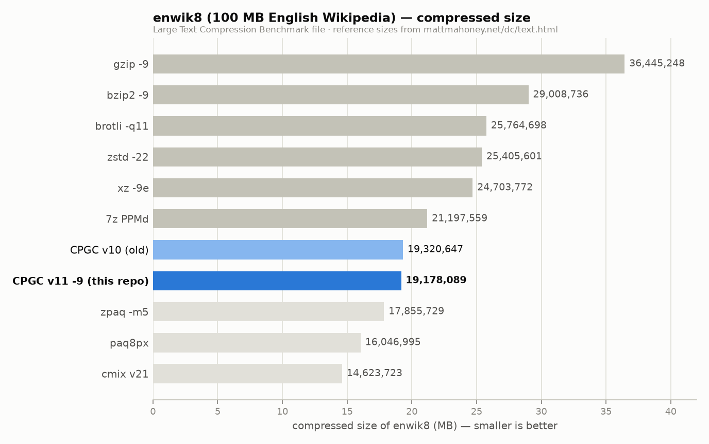
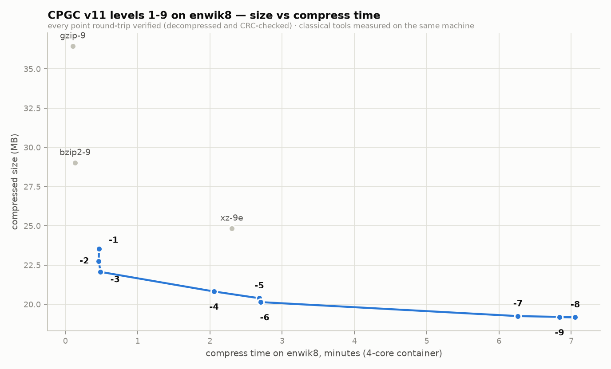
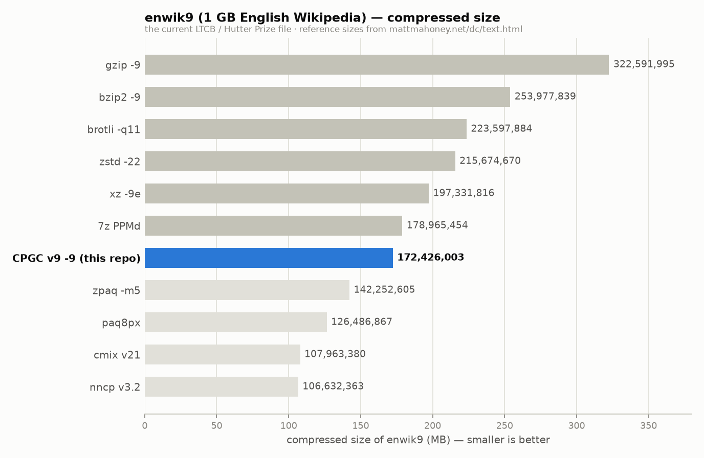

# CPGC

CPGC is an experimental, lossless general-purpose compressor built around the
**CPGC-NX** bit-level context-mixing engine. It includes a command-line tool, a
native desktop archive browser, solid directory archives, parallel compression,
and CRC-32 verification.

CPGC is optimized for compression ratio, especially on text. It is not intended
to replace fast codecs such as zstd or gzip when latency is the main concern.

## Highlights

- Bit-level context mixing with hashed byte, word, sparse, stride, indirect,
  and long-match models
- Online two-layer logistic mixer, adaptive probability maps, and a binary
  arithmetic coder
- Parallel independent segments for large inputs
- Turbo profiles at levels 1–3 and larger-memory profiles at levels 7–9
- Adaptive text dictionary and reversible structured-data transforms
- Detection and passthrough of incompressible regions
- Single-file `.cpgc` and solid multi-file archive support
- Native GUI and optional Windows Explorer integration
- CRC-32 verification on every decoded archive

The encoder and decoder update the same model in lockstep, so model state is not
stored in the archive. The archive records its segment and model profile, making
decoding independent of the machine's CPU count and SIMD support.

## Install

Tagged releases publish binaries for Windows, macOS, and Linux. Windows releases
also include an installer.

[Download the latest release](https://github.com/Union-Crax/CPGC/releases/latest)

Available assets:

| Platform | Asset |
|---|---|
| Windows | `cpgc-x86_64-pc-windows-msvc.zip` |
| Windows installer | `CPGC-Setup.exe` |
| Linux | `cpgc-x86_64-unknown-linux-gnu.tar.gz` |
| macOS | `cpgc-x86_64-apple-darwin.tar.gz` |

## Build from source

Install the stable [Rust toolchain](https://rustup.rs/), clone the repository,
then build the binary you need:

```sh
# CLI
cargo build --release --bin cpgc

# Native GUI
cargo build --release --features gui --bin cpgc-gui
```

Built binaries are written to `target/release/`. On Linux, the GUI also needs
the X11/Wayland and OpenGL development libraries listed in
[the build workflow](.github/workflows/build.yml).

## CLI

```text
cpgc compress <input> [output] [--level <1-9>]
cpgc decompress <archive> [output]
cpgc verify <archive>
cpgc list <archive>
cpgc info <archive>
cpgc bench <corpus-directory>
```

`compress`, `decompress`, and `verify` also have the aliases `c`, `x`, and `t`.

### Common examples

```sh
# Creates notes.txt.cpgc at the default level (5)
cpgc compress notes.txt

# Choose an output path and compression level
cpgc compress notes.txt notes.cpgc --level 7

# Restore notes.txt from notes.txt.cpgc
cpgc decompress notes.txt.cpgc

# Pack and extract a directory as a solid archive
cpgc compress project/ project.cpas
cpgc decompress project.cpas restored-project/

# Decode and verify without writing output
cpgc verify project.cpas

# Inspect an archive
cpgc list project.cpas
cpgc info notes.cpgc
```

If no compression output is supplied, CPGC appends `.cpgc`. If no extraction
output is supplied, it strips `.cpgc` or `.cpas`; otherwise it appends `.out`.
Directory inputs are automatically stored as solid multi-file archives.

## Compression levels

Levels trade speed, parallelism, memory, and ratio. Level 5 is the default.

| Level | Segment size | Model | Memory profile | Block transforms |
|---:|---:|---|---|---|
| 1 | 1 MiB | Turbo + text dictionary | Standard | No |
| 2 | 2 MiB | Turbo + text dictionary | Standard | No |
| 3 | 4 MiB | Turbo + text dictionary | Standard | No |
| 4 | 8 MiB | Full | Standard | No |
| 5 | 16 MiB | Full | Standard | Yes |
| 6 | 32 MiB | Full | Standard | Yes |
| 7 | 64 MiB | Full | Big | Yes |
| 8–9 | 64 MiB | Full | Extra large | Yes |

High-entropy regions may be stored without context mixing at every level.
Levels 7–9 can require substantial memory on large files; use level 5 or 6 on
memory-constrained systems. Levels 8 and 9 currently use the same codec profile.

## Desktop GUI

Build with the `gui` feature, then run:

```sh
cpgc-gui
cpgc-gui /path/to/folder
cpgc-gui archive.cpgc
```

The GUI can browse folders and archives, create archives, extract selected or
all members, test integrity, show archive information, switch themes, and
pause, resume, or cancel long operations.

### Windows Explorer integration

From a stable installation path, run:

```sh
cpgc register
cpgc unregister
```

Registration is per-user under `HKCU` and does not require administrator
rights. It adds compression actions for files and folders plus open, extract,
and test actions for `.cpgc` and `.cpas` archives.

## The English Wikipedia benchmarks

### enwik8

[enwik8](https://mattmahoney.net/dc/textdata.html) is the first 100,000,000
bytes of the English Wikipedia dump and a standard text-compression benchmark.
Every CPGC v11 archive below was decompressed and CRC-verified.



At level 9, CPGC produces **19,178,089 bytes (1.534 bits/byte)**. That is 22%
smaller than xz `-9e`, 24% smaller than zstd `-22`, 25% smaller than brotli
`-q11`, 9.5% smaller than 7-Zip's PPMd, and 4.5% smaller than the original
CPGC v9 (0.7% beyond v10). Research compressors such as zpaq, PAQ8, cmix, and
nncp still achieve better ratios, at substantially higher runtime cost.

#### All nine levels



| Level | Compressed size | Bits/byte | Compress | Decompress | Round-trip |
|---:|---:|---:|---:|---:|:---|
| 1 | 23,539,435 B | 1.883 | 28 s | 25 s | Verified |
| 2 | 22,743,019 B | 1.819 | 28 s | 25 s | Verified |
| 3 | 22,065,155 B | 1.765 | 29 s | 28 s | Verified |
| 4 | 20,818,067 B | 1.665 | 123 s | 126 s | Verified |
| 5 | 20,388,399 B | 1.631 | 161 s | 164 s | Verified |
| 6 | 20,140,482 B | 1.611 | 162 s | 164 s | Verified |
| 7 | 19,249,638 B | 1.540 | 376 s | 367 s | Verified |
| 8 | 19,178,089 B | 1.534 | 423 s | 415 s | Verified |
| 9 | **19,178,089 B** | **1.534** | 410 s | 438 s | Verified |

These measurements used a four-core container. Levels 8 and 9 currently
produce identical archives. Turbo level 1 compressed faster than xz `-9e` in
this environment (27 seconds versus 138 seconds) while producing a smaller
archive.

### enwik9

[enwik9](https://mattmahoney.net/dc/textdata.html) is the first 1,000,000,000
bytes of the same dump and is used by the Large Text Compression Benchmark and
the Hutter Prize. Every run was decompressed and CRC-verified.



| Level | Compressed size | Bits/byte | Compress | Decompress | Round-trip |
|---:|---:|---:|---:|---:|:---|
| 1 | 205,675,118 B | 1.645 | 4 min | 4 min | Verified |
| 3 | 192,017,370 B | 1.536 | 4 min | 4 min | Verified |
| 5 | 176,815,015 B | 1.415 | 18 min | 19 min | Verified |
| 9 | **165,237,676 B** | **1.322** | 35 min | 33 min | Verified |

These measurements used the same four-core container. The level 9 run was
capped at three workers so the extra-large models fit within 15 GB of RAM. Its
165,237,676-byte output is 16.3% smaller than xz `-9e`, 23% smaller than zstd
`-22`, and 7.7% smaller than 7-Zip's PPMd on the reference ranking, and 4.2%
smaller than CPGC v9. The default level 5 also comfortably beats PPMd's best
reported size.

Full measurements and chart-generation scripts are in [`benchmarks/`](benchmarks/):

- [`results.csv`](benchmarks/results.csv) — complete enwik8 level sweep
- [`enwik9_results.csv`](benchmarks/enwik9_results.csv) — enwik9 results
- [`make_charts.py`](benchmarks/make_charts.py) — reproducible charts
- [`run_bench.sh`](benchmarks/run_bench.sh) — benchmark runner

## Project status

CPGC is experimental and its archive format is still evolving. The current
decoder accepts format version 11 archives; retain a matching binary for older
archives. For important data, keep an independent copy and use `cpgc verify`
after compression.

Run the test suite with:

```sh
cargo test --release --features gui
```
