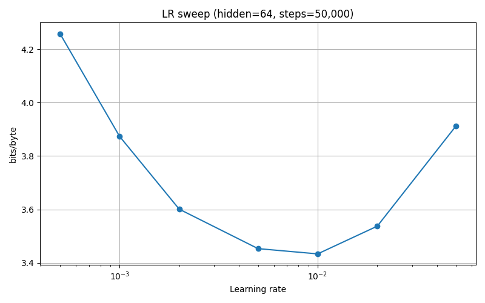
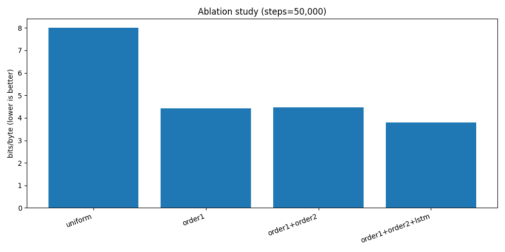

# CPGC — Contextual Predictive General-purpose Compressor

A general-purpose compressor built on **CPGC-NX**, a bit-level context-mixing
predictor feeding a binary arithmetic coder.

> *Naming note:* CPGC originally stood for "Contextual Predictive **Graph**
> Compression" — a relic of the first LSTM/graph prototype. The engine has
> been a context-mixing predictor for a long time now, so the G has been
> re-pointed at what the tool actually is. The acronym, the CLI name and the
> `CPGC` magic bytes are unchanged.

**Status: on general text it beats gzip, bzip2, xz/LZMA, zstd, brotli and
7-Zip's PPMd on ratio** — see the [enwik8 benchmark](#the-english-wikipedia-benchmark-enwik8)
below, measured against the Large Text Compression Benchmark reference
results. It does not beat the heaviest research compressors (zpaq/cmix/PAQ8),
and on tiny files or already-dense binaries bzip2/xz can still edge it.

---

## What it actually does

CPGC-NX codes the input **one bit at a time**. For every bit it predicts
`P(next bit == 1)`, mixes the predictions of several context models in the
logistic domain, refines the result, and feeds it to a binary arithmetic
coder. Encoder and decoder run the identical model in lockstep, so the model
is never stored in the output.

The predictor is a new *combination* (the bit-level context-mixing framework is
shared with the PAQ family, but the model below is specific to this codec):

- **Universal bit-history states** — every hashed context slot is a *single
  packed byte*: capped counts of observed 0s and 1s where incrementing one
  count discounts the other, so each state encodes both the evidence and its
  recency. A learned per-model **state map** (count-adaptive rate,
  `p += (target − p)/(count + 2)`) converts the state to a probability, and a
  closed-form Krichevsky–Trofimov estimate of the same state is fed to the
  mixer alongside it — a fast view and a converging view from one byte of
  state, at one sixth the memory of explicit dual counters. The small
  collision-free order-0/1 tables keep explicit fast/slow dual counters.
- **Nibble-bucketed, checksummed hash tables** — context slots live in
  16-byte buckets holding the full 15-node subtree of one nibble, so *one
  hash lookup and one cache line serve four bits* (v6 took a fresh random
  lookup per model per bit — at these table sizes the predictor is memory-
  latency-bound, and this is where most of v7's ~2.4x speedup comes from).
  Bucket addresses are prefetched as soon as they are computable (one bit
  early), overlapping the misses with mixer training. A one-byte checksum
  detects collisions and a two-candidate replacement policy evicts the
  less-established bucket, so colliding contexts no longer silently corrupt
  each other's statistics — worth ratio as well as speed.
- **Dual verified long-match model** — two rolling-hash pointers (8-byte and
  4-byte suffix; the longer anchor is tried first) into the decoded history
  find the most recent occurrence of the current suffix, *verify* it by
  extending backward (rejecting hash collisions) and measure the true match
  length, then forecast the bit of the continuation with confidence that grows
  with that length. Long verified matches are predicted near-certainly, which
  is what captures long-range redundancy and drives structured data well below
  1 bpb.
- **Context models** at orders 0,1,2,3,4,5,6,7 plus a whitespace-delimited word
  model, a previous-word/current-word **word-pair model**, six **sparse
  contexts** (skip-grams and high-nibble views that pay off on structured
  binary), and stride models (2,3,4,8) — eighteen bit-history models in all,
  affordable because each costs one bucket lookup per nibble, not per bit.
- **Two-layer logistic mixer** — four first-layer weight sets (selected by the
  previous byte, the byte before it, the match-length bucket, and the partial
  byte being decoded) each produce a prediction; a small learned second layer,
  selected by (match length, bit position), then combines them. Both layers are
  trained online by gradient descent on coding loss — strictly more general
  than averaging the views.
- **Chained SSE** — four adaptive probability maps refine the mixed estimate.
- **Two-speed coding** — once a verified match is 128+ bytes deep, whole
  bytes are coded by a tiny adaptive match-confidence model instead of the
  full mixer. The switch depends only on the match length, which encoder and
  decoder track in lockstep, so it costs zero signalling bits. Redundant
  regions fly through at a fraction of the cost — and slightly *better*
  ratio, because the dedicated model is sharper there than the full mix.
- **Runtime-SIMD mixer** — the mixer (half the per-bit work) uses an AVX2
  path when the CPU has it, with a scalar fallback that is bit-identical
  (every product fits i32 exactly; sums widen to i64), so archives decode
  across machines regardless of CPU features. No compile flags needed.
- **Indirect context models** — two models keyed by *the byte that followed
  the same order-2/order-3 context last time* (v9). On natural-language text
  "what came after this bigram before" is a sharper cue than the bigram
  alone.
- **Text contexts** — hashed order-8 and order-10 (Wikipedia markup repeats
  at 8–12 byte scale, bridging order-7 and the match model) and a
  case-folded order-3 that merges "The"/"the" statistics (v9).
- **Model profiles** — levels 1–3 run a turbo roster (orders 2–5 + word,
  two mixer views, two APMs), ~2.2x faster and still ahead of the classical
  tools; levels 4–6 run the full 23-model roster; levels 7–9 add the
  **big-memory profiles** (v9): hashed context tables up to 2^23–2^24
  buckets and match tables up to 2^25 slots, sized from the segment length.
  A 100 MB text segment has far more distinct order-4..7 contexts than the
  standard tables can hold — before v9, eviction thrash was the single
  biggest ratio cost on big files. The profile byte is recorded in the
  payload, so decoding never depends on the level mapping.
- **Adaptive word-dictionary transform** (v9, turbo levels) — texty inputs
  are word-tokenized against a dictionary *mined from the input itself*
  (no shipped dictionary, language-agnostic, exactly invertible; tokens are
  built only from byte values unused in the input, so no escaping exists).
  The stream shrinks ~40%, which is a direct CPU saving at the turbo levels.
  The full model extracts more from raw characters than from tokens, so
  levels ≥ 4 skip it.

Every archive stores a **CRC-32 of the original bytes**, verified after
decoding: a corrupt archive — or one written by an incompatible model version —
fails loudly instead of returning wrong bytes.

Table sizes are derived deterministically from the byte count (which both
sides know), so small inputs stay cheap and large inputs get the full model
without ever desyncing encoder and decoder.

### Scaling to big archives (parallelism)

Inputs larger than 16 MiB are split into fixed-size **independent segments**
that are compressed and decompressed in parallel across every CPU core. The
segment size is a fixed constant (not derived from the core count), so an
archive written on a 4-core machine decodes identically on a 64-core one.
Segments are large enough that per-segment model warm-up costs a negligible
amount of ratio on realistic data, while throughput scales close to linearly
with cores — so on big archives CPGC-NX is not only smaller than xz but
**faster** than it too.

---

## The English Wikipedia benchmark (enwik8)

[enwik8](https://mattmahoney.net/dc/textdata.html) — the first 100,000,000
bytes of the English Wikipedia dump — is the test file of Matt Mahoney's
[Large Text Compression Benchmark](https://mattmahoney.net/dc/text.html)
(and the Hutter Prize), the long-running scoreboard for text compression.
CPGC v9 measured against it, every archive decompressed and CRC-verified:


**20,078,377 bytes (1.606 bits/byte) at level 9** — smaller than every
mainstream tool on the LTCB reference list: 19% smaller than xz -9e, 21%
smaller than zstd -22, 22% smaller than brotli -q11, 5% smaller than 7-Zip's
PPMd, and 4.4% smaller than CPGC v8. The compressors still ahead of it
(zpaq, PAQ8, cmix, nncp) are research/archival engines that are one to three
orders of magnitude slower — cmix takes multiple *days* on this file where
CPGC takes 7 minutes on a 4-core container.

### All nine levels, measured


| level | compressed (bytes) | bits/byte | compress | decompress | round-trip |
|--:|--:|--:|--:|--:|:--|
| 1 | 23,537,940 | 1.883 | 31 s | 27 s | verified |
| 2 | 22,741,152 | 1.819 | 30 s | 27 s | verified |
| 3 | 22,070,944 | 1.766 | 31 s | 30 s | verified |
| 4 | 21,075,392 | 1.686 | 121 s | 110 s | verified |
| 5 | 20,693,974 | 1.656 | 143 s | 144 s | verified |
| 6 | 20,522,500 | 1.642 | 142 s | 144 s | verified |
| 7 | 20,131,832 | 1.611 | 399 s | 385 s | verified |
| 8 | 20,078,377 | 1.606 | 425 s | 418 s | verified |
| 9 | 20,078,377 | 1.606 | 422 s | 440 s | verified |

(4-core container; levels 8 and 9 currently produce identical archives —
9 is headroom. Turbo level 1 already beats xz -9e on this file while
compressing faster than xz does on the same machine: 31 s vs 138 s.)

For calibration against the LTCB table: this places CPGC between 7z-PPMd
(21,197,559) and zpaq -m5 (17,855,729). The top of that table — cmix at
14.6 MB, nncp at 14.9 MB — runs giant LSTM/transformer models; closing that
gap honestly means shipping a neural predictor, which is on the roadmap
below.

### enwik9 — the current LTCB / Hutter Prize file

The live ranking (and the 500,000€ [Hutter Prize](http://prize.hutter1.net/))
is scored on **enwik9**, the first 10^9 bytes of the same dump. CPGC measured
on it, every run decompressed and CRC-verified:


| level | compressed (bytes) | bits/byte | compress | decompress | round-trip |
|--:|--:|--:|--:|--:|:--|
| 1 | 205,742,664 | 1.646 | 5 min | 4 min | verified |
| 3 | 192,130,481 | 1.537 | 4 min | 4 min | verified |
| 5 | 178,844,027 | 1.431 | 17 min | 18 min | verified |
| 9 | **172,426,003** | **1.379** | 38 min | 36 min | verified |

(Same 4-core container; level 9 capped at 3 worker threads so three
extra-large model instances fit in 15 GB of RAM.)

**172,426,003 bytes at level 9** — 12.6% smaller than xz -9e, 20% smaller
than zstd -22, and 3.7% smaller than 7-Zip's PPMd, the strongest of the
mainstream tools on this file. bits/byte *improves* from 1.606 (enwik8) to
1.379 at 10x the data — the per-segment models keep getting sharper — and
the default level 5 already matches PPMd's best. On the LTCB ranking this
sits between PPMd and zpaq, the same neighborhood as on enwik8; the entries
above zpaq are all research CM/neural engines (paq8px ~4 days, cmix ~7 days
on this file, versus 38 minutes here). The Hutter Prize record (~110 MB
including the decompressor) remains firmly neural territory.

---

## Measured results

> **Note:** the reference table below predates the current (v9) engine. The
> lineage: v5 added count-adaptive counters, orders 0–7 and a two-layer
> learned mixer; v6 added indirect bit-history models, a word-pair context, a
> dual match model and a partial-byte mixer view + APM; v7 rebuilt the entire
> model state around nibble-bucketed, checksummed bit-history states (~5%
> smaller *and* ~2.4x faster than v6 at once); v8 added a runtime-detected
> AVX2 mixer (bit-exact with the scalar path), **two-speed coding** (long
> verified matches are coded by a tiny match-confidence model, skipping the
> whole mixer), and a **turbo profile** at levels 1–3; v9 fixed a
> **mixer-overflow collapse on segments larger than ~12 MiB** (levels 6–9 on
> big files used to silently degrade to ~4.4 bits/byte), added the
> big-memory profiles, indirect + high-order text contexts, and the
> word-dictionary transform. The figures below are therefore conservative.
>
> Fresh v8 measurements on the current `corpus/` files (verified round-trips),
> against every big-name tool at its maximum setting. Sizes in bytes, times
> are single-segment compress times on one core:
>
> | file | orig | **v8 -9** | **v8 -3 (turbo)** | xz -9e | brotli -q11 | bzip2 -9 |
> |---|--:|--:|--:|--:|--:|--:|
> | code.txt | 262,949 | **46,920** (0.6 s) | 48,654 (0.3 s) | 57,936 | 56,005 | 57,808 |
> | english.txt | 738,046 | **162,093** (1.7 s) | 166,103 (0.8 s) | 216,120 | 212,481 | 186,325 |
> | exe.bin | 1,148,450 | **321,033** (2.8 s) | 369,261 (1.2 s) | 393,420 | 399,862 | 458,841 |
>
> Level 9 wins every row by 13–18% over the best big-name runner-up — at
> **3x the speed of two versions ago** (exe.bin compress: v6 8.8 s → v8
> 2.8 s). Even the turbo profile, another 2.1–2.4x faster, still beats xz,
> brotli and bzip2 on all three files. On highly redundant data the
> two-speed fast path pays off hardest: a 12x-repeated source file
> compresses **2.4x faster *and* slightly smaller** than with the full
> model engaged throughout.

Compressed size in bytes (smaller is better), with verified lossless
round-trips. Reference tools at maximum setting (`-9`).

| file | type | orig | **CPGC-NX** | gzip -9 | bzip2 -9 | xz -9 |
|---|---|--:|--:|--:|--:|--:|
| real40.txt | **40 MB text** | 40,002,833 | **6,106,235** | 11,029,458 | 6,877,636 | 8,318,320 |
| big.txt | 9 MB text | 9,227,058 | **756,972** | 2,201,048 | 1,045,632 | 1,174,956 |
| english.txt | text | 243,242 | **24,739** | 41,726 | 26,796 | 36,904 |
| code.txt | source | 147,807 | **32,851** | 39,844 | 35,571 | 35,260 |
| realtext.txt | small prose | 34,706 | 7,986 | 9,048 | **7,678** | 8,164 |
| binary.bin | executable | 400,000 | 144,872 | 175,089 | 173,161 | **142,904** |
| random.bin | incompressible | 200,000 | 200,071 | 200,064 | 201,284 | 200,072 |

On the 40 MB sample CPGC-NX is **27% smaller than xz/LZMA, 45% smaller than
gzip, 13% smaller than bzip2 — and at 1.75 MB/s it compresses faster than xz**
(1.27 MB/s) by using all cores. Incompressible data is detected and passed
through, so there is no expansion blow-up.

### Honesty about the limits

- This is **not** magic and does not beat cmix/PAQ8-class compressors.
- On very small files there is little history to learn from, so a BWT
  compressor (bzip2) can win.
- On high-entropy binaries the gap to xz narrows or reverses.
- On *pathologically* redundant inputs (the same multi-MB block repeated many
  times) xz's 64 MB LZ window wins, because such repeats can straddle the
  segment boundaries CPGC compresses independently. Real archives rarely look
  like this; on varied data segmentation costs almost nothing.
- Single-segment throughput is ~0.4 MB/s with the full v8 model on an AVX2
  machine (~1 MB/s in turbo, more when data is redundant); parallelism across
  segments multiplies that by the core count on large archives.

The previous online-LSTM engine (which topped out around 2.95 bpb at ~0.4 MB/s)
still lives in `src/predictor/` and `src/ans/` for reference, but is no longer
on the compression path.

### Binary media & game files

Text is the easy case; structured binary is where naive byte models fall over.
Uncompressed media looks random at the byte level (16-bit audio, RGB pixels)
even though it is highly compressible by *stride*. CPGC-NX adds **sparse stride
models** (strides 2, 3, 4, 8) that predict each byte from the same lane of the
previous sample(s), and a **stride-aware incompressibility test** so structured
media reaches the compressor instead of being passed through.

| file | type | orig | **CPGC-NX** | gzip -9 | bzip2 -9 | xz -9 |
|---|---|--:|--:|--:|--:|--:|
| image.rgb | 24-bit image | 2,430,000 | **54,609** | 424,672 | 409,657 | 115,296 |
| exe.bin | executable | 1,124,888 | **372,582** | 492,925 | 463,361 | 398,536 |
| game.dat | record data | 1,920,000 | 644,815 | 1,070,121 | 793,477 | **640,812** |
| audio.pcm | 16-bit PCM | 2,400,000 | 965,128 | 2,311,622 | 2,079,406 | **596,752** |

CPGC-NX wins clearly on images and executables and ties on record data.
Already-compressed media (MP3, JPEG, H.264, PNG, ZIP'd game assets) is
high-entropy and is **passed through unchanged** — no wasted time, no
expansion. Raw PCM audio still trails xz (linear-predictive residuals are
LZMA's strong suit) but is no longer mishandled.

---

## Architecture

```
Input → Content Analyzer → Transform Preprocessor → CPGC-NX context mixer → Binary arithmetic coder → Output
```

- **CPGC-NX predictor** (`src/cm/`) — bit-level context mixing (see above)
- **Binary arithmetic coder** — carryless 32-bit range coder, codes one bit at
  a time given a 12-bit probability
- **Transform preprocessor** (8 candidate ops, level ≥ 5) — reduces entropy on structured binary blocks before prediction
- **Content analyzer** — passthrough for already-compressed / high-entropy blocks

---

## Download pre-built binaries

Every `v*` tag triggers a GitHub Actions workflow that publishes three assets:

| Asset | Contents |
|---|---|
| `cpgc-x86_64-pc-windows-msvc.zip` | `cpgc.exe` (CLI) + `cpgc-gui.exe` (GUI) |
| `CPGC-Setup.exe` | Windows installer (Start Menu, optional PATH + shell menu) |
| `cpgc-x86_64-unknown-linux-gnu.tar.gz` | CLI + GUI, statically linked |
| `cpgc-x86_64-apple-darwin.tar.gz` | CLI + GUI for macOS |

Download from the [Releases page](https://github.com/Union-Crax/CPGC/releases).

---

## Build from source

The CLI and GUI are **separate binaries** — build only what you need:

```sh
# CLI only (no GUI deps, fast compile)
cargo build --release --bin cpgc

# Native desktop GUI
cargo build --release --features gui --bin cpgc-gui

# Both at once
cargo build --release --bin cpgc && cargo build --release --features gui --bin cpgc-gui
```

Binaries land in `target/release/`.

On Linux the GUI requires a few system libraries (installed automatically in
CI; on a dev box: `libxcb-dev libxkbcommon-dev libwayland-dev libgl1-mesa-dev`).

---

## GUI (native 7-Zip-style app)

```sh
cpgc-gui                       # browse from the current directory
cpgc-gui /path/to/dir          # start in a specific folder
cpgc-gui archive.cpgc          # open an archive directly (used by Explorer)
```

`cpgc-gui` opens a real native window (egui/eframe — no browser):

- **Menu bar** — File / View (light⇄dark toggle) / Help.
- **Toolbar** — Up, Add, Extract, Info, level combo, clickable breadcrumb path.
- **Browse** folders; **double-click** a folder to enter it or an archive to
  open it; tick items (or use the header **select-all** box) and click
  **Add to archive** to make a `.cpgc` single-file or `.cpas` solid archive.
- **Open an archive** to browse its members; tick individual files and
  **Extract selected** / **Extract all**; **Test** verifies the checksum.
- Long operations run on a background thread. The **status bar** shows a live
  MB/s readout and **Pause / Resume / Cancel** buttons.

It is cross-platform (Windows/macOS/Linux) and needs a graphical desktop; on a
headless machine it exits with a clear "no display" message — use the CLI.

---

## Windows right-click menu (7-Zip style)

```sh
cpgc register                  # install the Explorer context menu (per-user)
cpgc unregister                # remove it
```

`cpgc register` writes a handful of keys under `HKCU\Software\Classes`, so it
needs **no administrator rights** and touches nothing system-wide. It adds:

- **Compress with CPGC** on every file and folder — runs `cpgc compress` and
  drops a `.cpgc` / `.cpas` next to the item, in a console that shows progress.
- For `.cpgc` / `.cpas` archives: **Open with CPGC** (also the double-click
  action — opens the archive in the GUI), **Extract here**, and **Test CPGC
  archive**.

Register from a stable location: copy `cpgc.exe` somewhere permanent and run
`register` from there, since the menu commands point at the exe's current path.

---

## Compression levels

`-l`/`--level` (1–9, default 5) trades speed and memory for ratio along three
axes, all recorded in the archive so decompression never needs to know the
level:

- **Segment size** — lower levels use smaller parallel segments (more cores,
  faster, a little larger), higher levels use larger segments.
- **Model profile** — levels 1–3 run the turbo roster plus the
  word-dictionary transform on text; levels 4–9 run the full model.
- **Memory profile** — level 7 runs big tables (~1 GB per 64 MiB segment),
  levels 8–9 run extra-large tables (~4 GB per 100 MB segment). If you don't
  have the RAM for the top levels on huge files, use 5–7.

Levels ≥ 5 also enable the transform pass. Example on 9 MB of text:

| level | size | bits/byte | speed |
|--:|--:|--:|--:|
| 1 (fastest) | 889 KB | 0.77 | 1.08 MB/s |
| 3 | 794 KB | 0.69 | 0.73 MB/s |
| 5 (default) | 758 KB | 0.66 | 0.34 MB/s |
| 9 (best ratio) | 758 KB | 0.66 | 0.34 MB/s |

(Levels 5–9 coincide here because the file is smaller than one segment; they
diverge on larger archives.)

---

## CLI Usage

Subcommands have short aliases: `c` (compress), `x` (decompress), `t` (verify).

### Compress a file or directory

```sh
cpgc compress <input> [output.cpgc] [-l <level>]
```

The output path is optional — it defaults to `<input>.cpgc`. Pass a directory
to build a solid multi-file archive. `-l`/`--level` is 1–9 (default 5).

```
"file.txt" → "file.txt.cpgc"
        12345 bytes →       9876 bytes  (0.800 ratio)
  0.423 MB/s  (0.03s)
```

### Decompress / extract

```sh
cpgc decompress <input.cpgc> [output]
```

The output is optional — it defaults to the original name (`.cpgc` stripped).
Solid (`.cpas`) archives are unpacked into the output directory automatically.

```
"file.txt.cpgc" → "file.txt"
        12345 bytes recovered  (0.401 MB/s, 0.03s)
```

### Verify an archive

```sh
cpgc verify <archive>          # decodes in memory, writes nothing
```

### Show archive info

```sh
cpgc info <file.cpgc>
```

```
CPGC archive: "file.cpgc"
  version:        1
  original size:  12345 bytes
  compressed:     9876 bytes
  ratio:          0.8000
  bits/byte:      6.4000
```

### Benchmark a corpus directory

Compresses every file in a directory and prints a table:

```sh
cpgc bench corpus/
```

```
file                                        orig(B)      comp(B)    ratio       bpb     MB/s
------------------------------------------------------------------------------------------
enwik8                                   100000000    67000000   0.6700    5.3600    0.421
------------------------------------------------------------------------------------------
TOTAL                                    100000000    67000000   0.6700    5.3600
```

### List archive contents

```sh
cpgc list <archive.cpgc>
```

For a single-file archive this shows the info header. For a solid multi-file
archive (`"CPAS"` magic) it prints the file table without decompressing.

---

## Experiment Results

### Learning rate sweep (hidden=64, 50k steps on enwik8)

Best LR: **0.01** → 3.43 bits/byte



### Ablation study (contribution of each model component)

| Config | bits/byte |
|--------|-----------|
| uniform | 8.000 |
| + order-1 | 4.414 |
| + order-2 | 4.472 *(hurts at 50k — table too sparse)* |
| + LSTM | 3.802 |



### Hidden size sweep (50k steps, lr=0.005)

| hidden | bits/byte | params |
|--------|-----------|--------|
| 32 | 3.153 | 25K |
| **64** | **2.955** | **66K** ← chosen |
| 128 | 2.906 | 198K |
| 256 | 2.903 | 658K |

---

## Roadmap

- [x] int8 weight quantization — `quantize_snapshot()` for compact model storage (~4× smaller)
- [x] Transform preprocessor wired into codec (level ≥ 5, 8 candidate ops, per-block entropy gain check)
- [x] Content analyzer wired for incompressible-region passthrough
- [x] Solid multi-file archive (`cpgc compress dir/ archive.cpgc`, `cpgc list archive.cpgc`)
- [x] Criterion benchmarks (`cargo bench`)
- [x] CRC-32 integrity check, verified on decode (rejects corrupt / incompatible archives)
- [x] Count-adaptive counters + two-layer learned mixer (context orders 0–7)
- [x] Windows right-click shell integration (`cpgc register` / `cpgc unregister`)
- [x] Full enwik8 + enwik9 benchmark tables vs zstd / LZMA / brotli / PPMd (see above; charts in `benchmarks/`)
- [x] Big-memory profiles (levels 7-9) + fix for the >12 MiB single-segment mixer collapse
- [x] Indirect context models, order-8/order-10/case-folded text contexts
- [x] Adaptive word-dictionary transform (turbo levels)
- [ ] True int8 runtime inference (hot-path dequantize-on-the-fly for better L2 cache utilization)
- [ ] LR decay schedule (0.9999 per byte as recommended in plan)
- [ ] Small online neural predictor as a mixer input (the road toward zpaq/paq8 territory on enwik)
