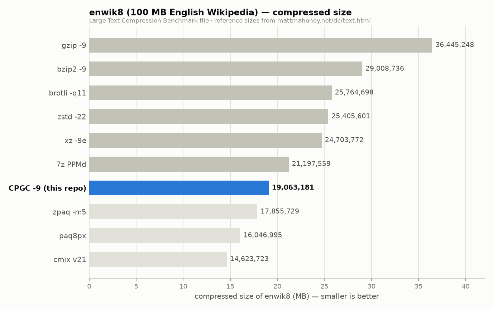
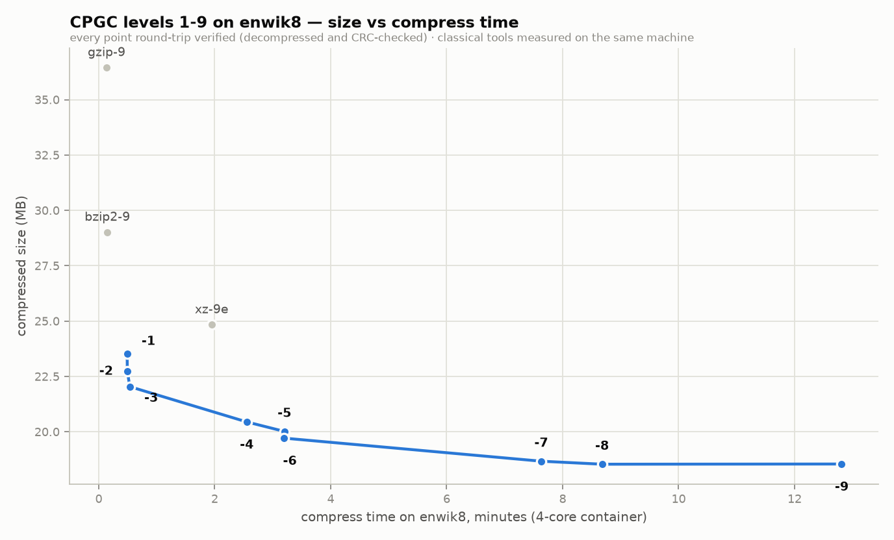
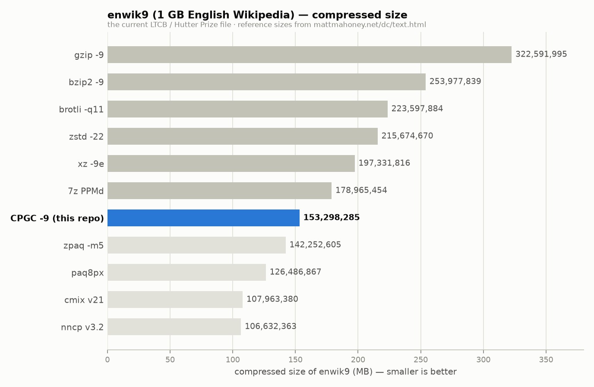

# CPGC

CPGC is an experimental, lossless compressor built on the **CPGC-NX** bit-level
context-mixing engine. It trades speed for ratio on text — it is not a
replacement for zstd or gzip when latency matters. It ships as a command-line
tool and a native archive-browser GUI, supports single-file `.cpgc` and solid
multi-file archives, and CRC-32-verifies every archive it decodes.

## How it works

The engine predicts each bit from 30 context models — hashed byte contexts
(orders 2–16), word, word-pair and word-trigram models, sparse and stride
contexts, indirect models, markup models that track the enclosing XML element,
the bracket nesting and the shape of the line, and a long-match model — combined
by a two-layer logistic mixer and sharpened by a chained SSE stage before a
binary arithmetic coder. Encoder and decoder update the same model in lockstep,
so no model state is stored in the archive; it records only the segment size and
model profile, so a file decodes identically regardless of the machine's CPU
count or SIMD support.

Large inputs are split into independent segments for parallel compression, with
the segment size rising with the level — every split restarts the models from
nothing, so a wider window compresses better, up to the point where the model
tables can no longer hold a segment's contexts. Incompressible regions are
detected and stored raw, and texty input can pass through an adaptive word dictionary or reversible
structured-data transforms.

## Install

Tagged releases publish binaries for Windows, macOS, and Linux. Windows releases
also include an installer.

[Download the latest release](https://github.com/Union-Crax/CPGC/releases/latest)

Available assets:

| Platform | Asset |
|---|---|
| Windows | `cpgc-x86_64-pc-windows-msvc.zip` |
| Windows installer | `CPGC-Setup.exe` |
| Linux | `cpgc-x86_64-unknown-linux-gnu.tar.gz` |
| macOS | `cpgc-x86_64-apple-darwin.tar.gz` |

## Build from source

Install the stable [Rust toolchain](https://rustup.rs/), clone the repository,
then build the binary you need:

```sh
# CLI
cargo build --release --bin cpgc

# Native GUI
cargo build --release --features gui --bin cpgc-gui
```

Built binaries are written to `target/release/`. On Linux, the GUI also needs
the X11/Wayland and OpenGL development libraries listed in
[the build workflow](.github/workflows/build.yml).

## CLI

```text
cpgc compress <input> [output] [--level <1-9>]
cpgc decompress <archive> [output]
cpgc verify <archive>
cpgc list <archive>
cpgc info <archive>
cpgc bench <corpus-directory>
```

`compress`, `decompress`, and `verify` also have the aliases `c`, `x`, and `t`.

### Common examples

```sh
# Creates notes.txt.cpgc at the default level (5)
cpgc compress notes.txt

# Choose an output path and compression level
cpgc compress notes.txt notes.cpgc --level 7

# Restore notes.txt from notes.txt.cpgc
cpgc decompress notes.txt.cpgc

# Pack and extract a directory as a solid archive
cpgc compress project/ project.cpas
cpgc decompress project.cpas restored-project/

# Decode and verify without writing output
cpgc verify project.cpas

# Inspect an archive
cpgc list project.cpas
cpgc info notes.cpgc
```

If no compression output is supplied, CPGC appends `.cpgc`. If no extraction
output is supplied, it strips `.cpgc` or `.cpas`; otherwise it appends `.out`.
Directory inputs are automatically stored as solid multi-file archives.

## Compression levels

Levels trade speed, parallelism, memory, and ratio. Level 5 is the default.

| Level | Segment size | Model | Memory profile | Block transforms |
|---:|---:|---|---|---|
| 1 | 1 MiB | Turbo + text dictionary | Standard | No |
| 2 | 2 MiB | Turbo + text dictionary | Standard | No |
| 3 | 4 MiB | Turbo + text dictionary | Standard | No |
| 4 | 8 MiB | Full | Standard | No |
| 5 | 16 MiB | Full | Standard | Yes |
| 6 | 32 MiB | Full | Standard | Yes |
| 7 | 64 MiB | Full | Big | Yes |
| 8 | 64 MiB | Full | Extra large | Yes |
| 9 | 256 MiB | Full | Maximum | Yes |

High-entropy regions may be stored without context mixing at every level.

Segment size is the ratio lever above level 4, and it does not flatten out where
you might expect: on 64 MiB of enwik8, one segment beats four 16 MiB segments by
5.1%. It does eventually stop paying, though, and level 9 sits at that point
rather than past it. The hashed tables cap at 2^25 buckets whatever the segment
size, so a 256 MiB segment holds about 136 bytes of input per context slot while
a 1 GiB one holds 531 — and compressed as a single 1 GB segment, enwik9 comes out
*worse* than splitting it. Level 9 therefore uses 256 MiB segments, the widest
window the tables can support, at about 8 GB of model per segment.

Levels 7 and above carry large models — roughly 2.5 GB, 5 GB and 8 GB per
segment at levels 7, 8 and 9 — so CPGC works out how many segments it can afford
to have in flight from the models' actual size and the machine's available
memory, rather than starting one per core. That only changes scheduling, never
the bytes produced: a machine with the memory to spare uses every core, and a
smaller one uses fewer workers instead of being killed. Levels 5 and 6 are a few
tens of MB per worker and always parallelise fully.

## Desktop GUI

Build with the `gui` feature, then run:

```sh
cpgc-gui
cpgc-gui /path/to/folder
cpgc-gui archive.cpgc
```

The GUI can browse folders and archives, create archives, extract selected or
all members, test integrity, show archive information, switch themes, and
pause, resume, or cancel long operations.

### Windows Explorer integration

From a stable installation path, run:

```sh
cpgc register
cpgc unregister
```

Registration is per-user under `HKCU` and does not require administrator
rights. It adds compression actions for files and folders plus open, extract,
and test actions for `.cpgc` and `.cpas` archives.

## The English Wikipedia benchmarks

### enwik8

[enwik8](https://mattmahoney.net/dc/textdata.html) is the first 100 MB of the
English Wikipedia dump, a standard text-compression benchmark. At level 9 CPGC
compresses it to **18,122,756 bytes (1.450 bpc)** — smaller than every
general-purpose codec below; the research compressors zpaq, PAQ8, and cmix
still lead. Every archive was round-trip decompressed and CRC-verified.



The nine levels trade compress time for ratio:



| Level | Compressed size | Bits/byte | Compress | Decompress |
|---:|---:|---:|---:|---:|
| 1 | 23,531,756 B | 1.883 | 29 s | 28 s |
| 2 | 22,720,026 B | 1.818 | 30 s | 28 s |
| 3 | 22,037,386 B | 1.763 | 32 s | 31 s |
| 4 | 20,445,942 B | 1.636 | 153 s | 148 s |
| 5 | 20,016,786 B | 1.601 | 192 s | 196 s |
| 6 | 19,712,978 B | 1.577 | 192 s | 194 s |
| 7 | 18,671,295 B | 1.494 | 458 s | 463 s |
| 8 | 18,535,007 B | 1.483 | 521 s | 529 s |
| 9 | **18,122,756 B** | **1.450** | 784 s | 786 s |

Measured on a four-core container.

Level 9 buys 2.2% over level 8 here and costs 50% more time. On a 100 MB input
it is a single segment, so it cannot use more than one core; on larger files it
splits at 256 MiB and parallelises again as memory allows.

### enwik9

[enwik9](https://mattmahoney.net/dc/textdata.html) is the first 1 GB of the same
dump — the Large Text Compression Benchmark and Hutter Prize file. At level 9
CPGC reaches **153,298,285 bytes (1.226 bpc)**, 5.8% smaller than the previous
release. The archive was round-trip decompressed and CRC-verified.



| Level | Compressed size | Bits/byte | Compress | Decompress |
|---:|---:|---:|---:|---:|
| 9 | **153,298,285 B** | **1.226** | 124 min | 128 min |

Four-core container with 15 GB of RAM; level 9 splits enwik9 into four 256 MiB
segments and runs them one at a time to stay inside that budget.

That places CPGC ahead of every general-purpose codec on this file and behind
the research compressors — zpaq -m5 reaches 142,252,605, paq8px 126,486,867 and
cmix 107,963,380. The gap to zpaq is about 7.8%.

The remaining headroom is memory rather than modelling. Every doubling of the
window paid — over the first 256 MB of enwik9, four 64 MiB segments give
48,491,970 bytes, two 128 MiB give 47,851,150, one 256 MB gives 45,980,493 —
until the tables stopped keeping up. Widening further needs 2^26-bucket tables,
roughly 11 GB of model against the 8 GB that fits here.

Full measurements and chart-generation scripts are in [`benchmarks/`](benchmarks/):

- [`results.csv`](benchmarks/results.csv) — complete enwik8 level sweep
- [`enwik9_results.csv`](benchmarks/enwik9_results.csv) — enwik9 results
- [`make_charts.py`](benchmarks/make_charts.py) — reproducible charts
- [`run_bench.sh`](benchmarks/run_bench.sh) — enwik8 runner
- [`run_bench9.sh`](benchmarks/run_bench9.sh) — enwik9 runner
- [`README.md`](benchmarks/README.md) — how to reproduce these numbers, what
  each level costs in memory, and where the remaining ratio headroom is

## Project status

CPGC is experimental and its archive format is still evolving. The current
decoder accepts format version 13 archives; retain a matching binary for older
archives. For important data, keep an independent copy and use `cpgc verify`
after compression.

Run the test suite with:

```sh
cargo test --release --features gui
```
